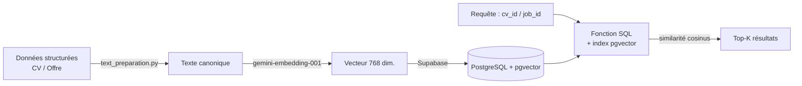

# CV–Job Matcher

Moteur de rapprochement sémantique entre des CV et des offres d'emploi, à partir d'**embeddings Gemini** et de la **recherche vectorielle** de PostgreSQL (**pgvector**) via Supabase.

> Ce module constitue ma contribution personnelle au sein d'un projet de groupe académique portant sur un système intelligent de mise en relation CV / offres d'emploi. Le présent dépôt documente uniquement le **moteur de matching** (préparation du texte, génération des embeddings, indexation et recherche par similarité).

---

## Aperçu

Le problème : comparer des CV et des offres d'emploi non pas par mots-clés exacts, mais par **sens**. Deux textes formulés différemment mais proches sémantiquement doivent être rapprochés.

L'approche retenue :

1. Les données structurées d'un CV ou d'une offre sont transformées en un **texte canonique** (`text_preparation.py`).
2. Ce texte est encodé en un **vecteur de 768 dimensions** avec le modèle `gemini-embedding-001`.
3. Les vecteurs sont **stockés dans Supabase (PostgreSQL + pgvector)**.
4. La mise en relation se fait par **similarité cosinus** entre vecteurs, dans les **deux sens** : meilleures offres pour un CV, et meilleurs CV pour une offre.

Les embeddings sont **pré-calculés hors ligne** (par lots), ce qui permet une recherche rapide au moment de la requête.

---

## Fonctionnement



Étapes principales, telles qu'implémentées dans le code :

- **Préparation du texte** — `prepare_job_announcement_text()` et `prepare_cv_text()` assemblent les champs pertinents (poste, contrat, expérience/formation requises, compétences, langues, entreprise, projets, certifications…) en un texte homogène prêt à être encodé.
- **Génération d'embeddings** — `generate_embedding()` appelle l'API Gemini avec un `task_type` (`RETRIEVAL_DOCUMENT` pour les éléments stockés, `RETRIEVAL_QUERY` pour une requête) afin d'optimiser le vecteur selon le contexte. `generate_embeddings_batch()` traite plusieurs textes avec temporisation entre les appels.
- **Peuplement & indexation** — `populate_jobs_from_announcements()` / `populate_cvs_from_user_cvs()` créent les enregistrements à encoder (opération **idempotente** : les entrées déjà présentes sont ignorées). `embed_all_jobs()` / `embed_all_cvs()` génèrent puis stockent les embeddings **par lots**.
- **Recherche** — `get_top_jobs_for_cv()` et `get_top_cvs_for_job()` appellent des fonctions SQL PostgreSQL (`match_jobs_by_cv_id`, `match_cvs_by_job_id`) qui exploitent l'opérateur de distance cosinus de pgvector (`<=>`) ; `get_top_jobs_for_cv_with_details()` complète les résultats avec le détail de l'offre.

---

## Stack technique

- **Python 3**
- **Google GenAI SDK** (`google-genai`) — modèle d'embeddings `gemini-embedding-001` (768 dimensions)
- **Supabase** (`supabase`) — PostgreSQL managé
- **pgvector** — stockage et recherche de vecteurs (côté base de données)
- **python-dotenv** — chargement des variables d'environnement

*(dépendances Python listées dans `requirements.txt`)*

---

## Structure du dépôt

| Fichier | Rôle |
|---|---|
| `cv_job_matcher.py` | Cœur du module : configuration, génération d'embeddings, peuplement, encodage par lots, fonctions de matching et interface en ligne de commande. |
| `text_preparation.py` | Conversion des données structurées (CV / offre) en texte canonique prêt à encoder. |
| `requirements.txt` | Dépendances Python. |

> **À noter :** le schéma des tables, l'index vectoriel (**HNSW**) et les fonctions SQL de matching (`match_jobs_by_cv_id`, `match_cvs_by_job_id`) vivent **côté base de données Supabase** et ne sont pas inclus dans ces fichiers Python. Voir « Configuration de la base de données ».

---

## Prérequis & installation

```bash
# 1. Cloner le dépôt
git clone https://github.com/Lobna08/cv-job-matcher.git
cd cv-job-matcher

# 2. (recommandé) créer un environnement virtuel
python -m venv venv
source venv/bin/activate      # Windows : venv\Scripts\activate

# 3. Installer les dépendances
pip install -r requirements.txt
```

---

## Configuration

Le module lit trois variables d'environnement (chargées via `python-dotenv`). Crée un fichier `.env` à la racine :

```env
GEMINI_API_KEY=ta_cle_gemini
SUPABASE_URL=https://ton-projet.supabase.co
SUPABASE_KEY=ta_cle_supabase
```


Paramètres ajustables dans `cv_job_matcher.py` :

- `EMBEDDING_MODEL` = `gemini-embedding-001`
- `EMBEDDING_DIMENSION` = `768`
- `BATCH_SIZE` = `100` (taille des lots d'encodage)
- `RATE_LIMIT_DELAY` = `0.1` (secondes entre deux appels API)

---

## Configuration de la base de données (requise)

Le code suppose l'existence, côté Supabase/PostgreSQL :

- de l'extension **pgvector** activée ;
- des tables sources `job_announcements` et `user_cvs`, ainsi que des tables `jobs` et `cvs` contenant au moins les colonnes `content` (texte) et `embedding` (`vector(768)`) ;
- d'un **index vectoriel** (HNSW) sur la colonne `embedding` pour accélérer la recherche du plus proche voisin ;
- de deux **fonctions SQL** appelées via RPC :
  - `match_jobs_by_cv_id(cv_id_param, match_count, match_threshold)`
  - `match_cvs_by_job_id(job_id_param, match_count, match_threshold)`

> **TODO :** ajouter au dépôt le script SQL de création de l'extension, des tables, de l'index HNSW et de ces deux fonctions (non fourni dans la version actuelle).

---

## Utilisation

### En ligne de commande

```bash
# Offres
python cv_job_matcher.py populate_jobs     # Créer les entrées 'jobs' depuis 'job_announcements'
python cv_job_matcher.py embed_jobs        # Générer les embeddings des offres
python cv_job_matcher.py full_jobs         # Pipeline complet (peuplement + embeddings)

# CV
python cv_job_matcher.py populate_cvs
python cv_job_matcher.py embed_cvs
python cv_job_matcher.py full_cvs

# Matching CV -> offres
python cv_job_matcher.py match <cv_id>             # Top 5 par défaut
python cv_job_matcher.py match <cv_id> 0.5         # Similarité >= 0.5
python cv_job_matcher.py match <cv_id> 0.7 10      # Similarité >= 0.7, top 10
python cv_job_matcher.py match_details <cv_id>     # Avec le détail des offres
```

### En Python

```python
from cv_job_matcher import init_clients, get_top_jobs_for_cv_with_details, get_top_cvs_for_job

supabase, _ = init_clients()

# Meilleures offres pour un CV
resultats = get_top_jobs_for_cv_with_details(supabase, cv_id="<uuid_cv>", top_k=5, threshold=0.5)
for r in resultats:
    print(r["similarity_score"], r.get("entreprise_name"), r.get("description"))

# Sens inverse : meilleurs CV pour une offre
candidats = get_top_cvs_for_job(supabase, job_id="<uuid_offre>", top_k=5)
```

---

## Détails du matching

- **Similarité cosinus** (`1 - distance_cosinus`) : mesure l'angle entre deux vecteurs, indépendamment de leur longueur — adaptée à la similarité sémantique de textes de tailles différentes. Plage 0–1 (1 = identique).
- **`task_type`** : les documents stockés sont encodés en `RETRIEVAL_DOCUMENT`, les requêtes en `RETRIEVAL_QUERY`, ce que l'API Gemini exploite pour améliorer la pertinence.
- **`top_k`** et **`threshold`** permettent de contrôler le nombre de résultats et le seuil minimal de similarité.

---

## Limitations & remarques

- Projet **académique / portfolio**, non destiné à un usage en production en l'état.
- Le module **dépend de la base de données** : sans les tables, l'index et les fonctions SQL décrits plus haut, le matching ne fonctionne pas.
- Le pipeline dépend de l'**API Gemini** (quotas / limitation de débit) ; une temporisation simple (`RATE_LIMIT_DELAY`) est prévue entre les appels.
- Les embeddings qui échouent sont conservés en `None` et comptés comme échecs, sans réessai automatique.
- Aucune évaluation quantitative (métriques de qualité du matching) n'est incluse à ce stade — **TODO** possible pour une future version.

---

## Périmètre

Module développé individuellement dans le cadre d'un projet de groupe académique ; il correspond à la partie **moteur de matching sémantique CV ↔ offre**.
